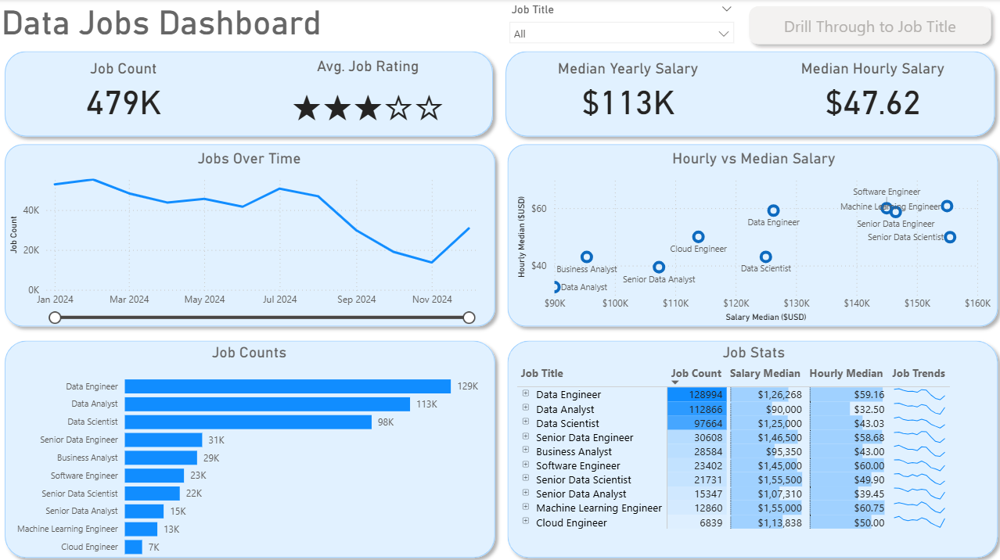
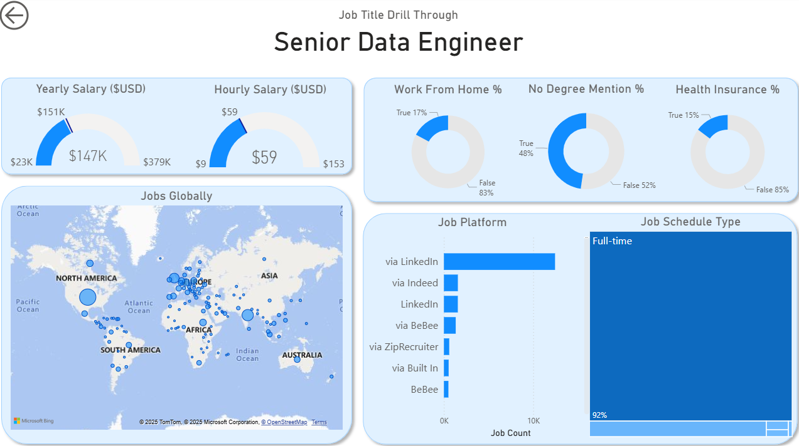

# 📊 Data Jobs Dashboard
An interactive **Power BI dashboard** built to explore the data jobs market. It highlights job demand, salary levels, global trends, and hiring platforms in a simple and clear way.  

## 🔹 Introduction  
The dashboard provides a market overview for job seekers, recruiters, and businesses.  
It explains which roles are in demand, how salaries vary, and where jobs are located.  
With interactive visuals and drillthrough pages, users can explore data in more detail.  

## 🛠 Skills Showcased  
- **Power Query:** Data cleaning and transformation  
- **Implicit Measures:** Built-in aggregations for quick insights  
- **Core Charts:** Bar, line, and scatter plots for analysis  
- **Geospatial Analysis:** Mapping job locations worldwide  
- **KPIs & Tables:** Key numbers with supporting detail views  
- **Dashboard Design:** Clean, structured, and user-friendly layout  
- **Slicers:** Interactive filters for easy exploration  
- **Buttons & Bookmarks:** Simple navigation across pages  
- **Drillthrough:** Focused insights on specific roles  

## 📷 Dashboard Overview  
  
The main dashboard shows total job postings, average ratings, median salaries, and how trends change over time.  
It also highlights top roles like **Data Engineer, Data Analyst, and Data Scientist**, with salary comparisons across positions.  

## 🔍 Drillthrough – Senior Data Engineer  
  
Drillthrough pages provide deeper insights into one role at a time.  
For **Senior Data Engineers**, the report shows salary ranges, remote work options, degree requirements, and job benefits.  
It also maps global demand and highlights LinkedIn as the main platform, with most opportunities full-time.  

## ✅ Conclusion  
The dashboard delivers clear and practical insights into the data job market.  
It helps users understand demand, salary benchmarks, remote work trends, and hiring sources.  
This makes it a useful tool for job seekers, recruiters, and organizations to make better decisions.  
