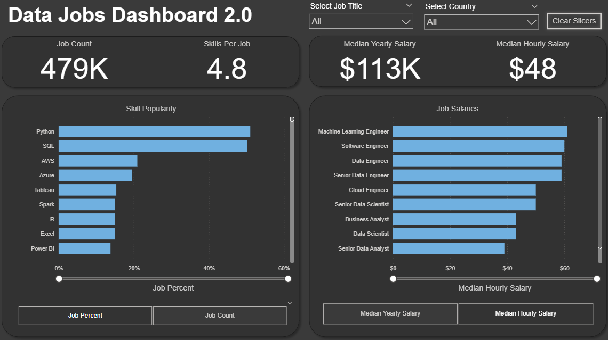

# 📂 Power BI Dashboard Portfolio

This repository showcases a collection of **Power BI dashboards** I’ve designed and developed.  
Each project focuses on solving a specific business or analytical problem, with clear visuals and actionable insights.

---

## 📌 Projects

### 1. 📊 Data Jobs Dashboard 1
A comprehensive dashboard exploring the **data jobs market**.  
It highlights job demand, salaries, global trends, and hiring platforms.

📷 **Preview**  

🔧 **Skills Showcased**  
- 🧹 **Power Query** – Cleaning and shaping raw data  
- 📊 **DAX & Measures** – Building calculations for insights  
- 🗂 **Data Modeling** – Relationships and implicit measures  
- 📈 **Visualizations** – Bar, line, scatter plots, KPIs, maps  
- 🎨 **Dashboard Design** – Layout, navigation, bookmarks  
- 🎛️ **Advanced Features** – Drillthrough, slicers, interactivity  

🔗 [Read Full Project Details](https://github.com/Thegunal/PowerBI-Dashboard/tree/main/Data_job_project1)

---

### 2. 📊 Data Jobs Dashboard 2 (Single-Page)
A **single-page dashboard** providing a quick and interactive view of the global data jobs market.  
It allows users to explore hiring trends, salaries, skills demand, and regional comparisons at a glance.

📷 **Preview**  

🔧 **Skills Showcased**  
- **⚡ Advanced Dashboard Design** – Single-Page UX & Optimization  
- **🛠 Power Query Transformations** – Complex data cleaning and shaping  
- **🗂 Data Modeling** – Star Schema principles for structured datasets  
- **📊 DAX & Measures** – Explicit calculations (e.g., CALCULATE, context modifiers)  
- **🎛 Dynamic Visualizations** – Driven by Parameters and Slicers  
- **🎯 What-If Analysis** – Field & numeric parameter implementation  
- **🗺 Geospatial Insights** – Enhanced maps and location-based analysis  
- **🖼 Advanced Card Visuals** – Custom KPIs and summary visuals  
- **🔄 Slicers & Cross-Filtering** – Optimized interactivity across the dashboard  

🔗 [Read Full Project Details](https://github.com/Thegunal/PowerBI-Dashboard/tree/main/Data_job_project2)

---
